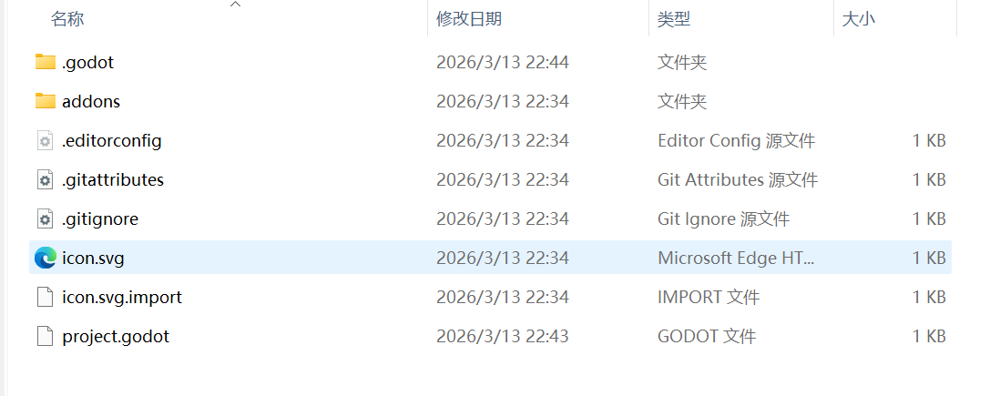
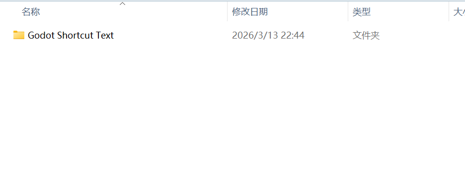
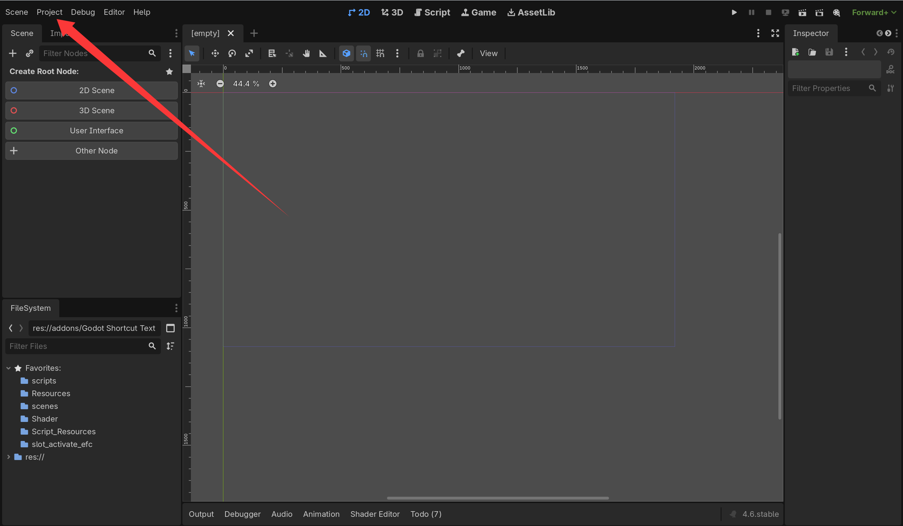
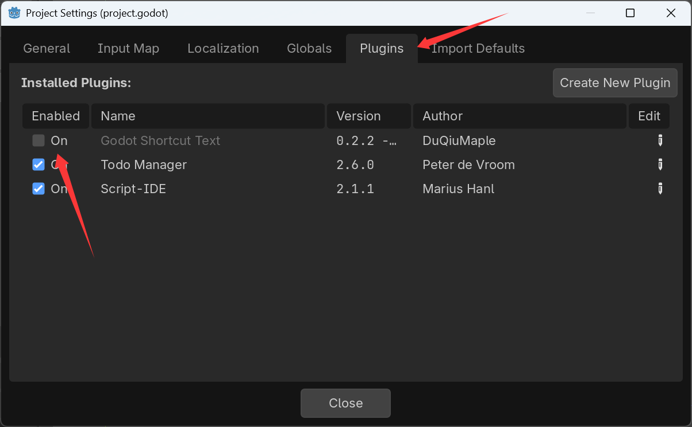
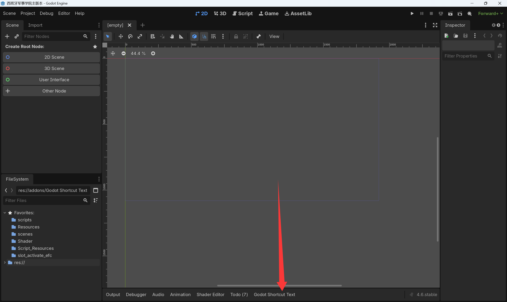
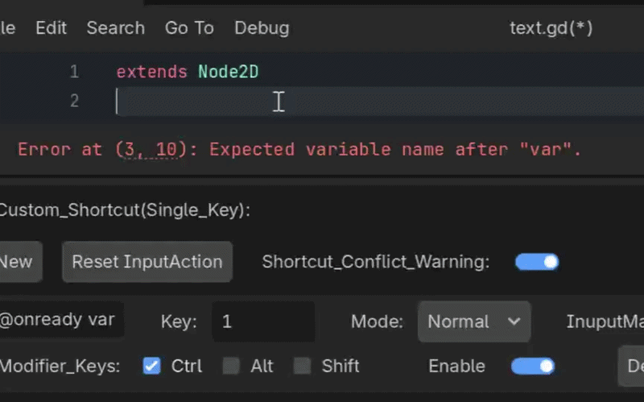
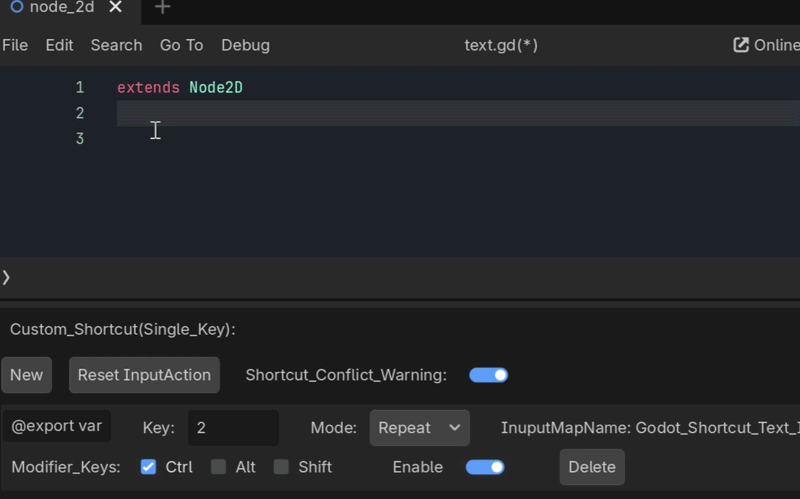
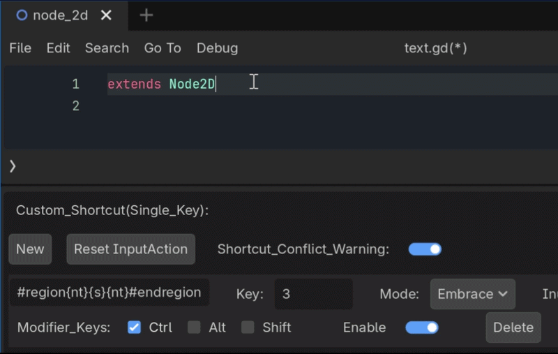

# GODOT Plugin: Insert Text with Shortcuts

Plugin Name: Godot Shortcut Text  
Version: 0.2.1 - beta  
Supported Godot Versions:4.6 4.x(Compatible Version)

## Plugin Introduction:
This is a Godot plugin that allows developers to customize shortcuts to insert their desired text. While the editor can suggest words based on the first few letters typed, it doesn't provide suggestions for some special texts, such as:
#region #endregion
This lack of suggestion reduces development efficiency. Moreover, this plugin allows for customizing much longer text snippets, not just single words.
This plugin was developed by me and is currently in beta. There are some bugs, and I will continue to update it.

## Table of Contents
-1. Installation Guide  
-2. Detailed Usage  
--2.1 Single Key vs. Multiple Key  
--2.2 Normal Mode (Default)  
--2.3 Repeat Mode  
--2.4 Embrace Mode  
--2.5 Precautions  
-3. Bugs and Warnings  
--3.1 Non-.gd Files Not Supported  
--3.2 Shortcut Conflicts with Multiple-Key Triggers  
--3.3 Shortcut Conflicts with Single-Key Triggers  
--3.4 Escape Characters  
-4. Contact Information

## 1. Installation Guide
The installation process for this plugin is the same as for other Godot plugins. If you already know how to install and use Godot plugins, you can skip this chapter.
**(1) Download the plugin version archive from the download link and extract it.**

**(2) Create a new folder named `addons` in your project directory, and drag the extracted files into the `addons` folder.**

**(3) Open your game project. In the top-left corner of the editor, go to: Project -> Project Setting -> Plugins. The plugin name will appear in the list. Enable the plugin.**

**(4) A dock named "Godot Shortcut Text" appears at the bottom of the editor, indicating the plugin has started successfully.**

## 2. Detailed Usage

### 2.1 Single Key vs. Multiple Key
First, developers can choose whether the shortcut is triggered by a single key or multiple keys.
**Note, single-key trigger means there is only one trigger key (A-Z, 0-9), but you can still add any number of modifier keys (Ctrl, Alt, Shift; on Mac, use Cmd instead of Ctrl).** Multiple-key trigger allows you to select any number of trigger keys.
Here, **I recommend using single-key trigger**, because the underlying implementation logic for multiple-key triggers differs from single-key triggers. Multiple-key triggers are more susceptible to shortcut conflicts (see 3.2 Shortcut Conflicts with Multiple-Key Triggers). Although single-key triggers can also have conflicts, the impact is relatively smaller, so single-key trigger is recommended.

### 2.2 Normal Mode (Default)
This is the default mode. In the plugin panel, create a new custom shortcut. In the `Insert_Text` field, enter the text you want to insert. It supports most escape characters (see 3.4 Escape Characters), but I recommend using `{n}` instead of `\n` (reason in 3.4). The plugin will automatically replace `{n}` with a newline. Enter your desired shortcut keys in the `Key` text box. Pressing Enter will automatically detect the `Key` text and select the first supported trigger key (a-z, A-Z, 0-9). You can then choose any number of modifier keys and enable the custom shortcut.
Pressing the shortcut in the code text will automatically insert the previously customized text.

### 2.3 Repeat Mode
`"@onready var "` is probably a very common text snippet. However, if you insert it using Normal Mode, you'll find that you have to manually insert a newline each time before you can insert another `"@onready var "` on the next line. This is cumbersome. Repeat Mode helps solve this problem.
Repeat Mode differs from Normal Mode in that it checks, before insertion, whether the current line where the text cursor is located starts with the same custom text. If it does, Repeat Mode will first automatically insert a newline and then insert the custom text. Furthermore, if the current line starts with a tab character, Repeat Mode will also automatically insert the same number of tabs on the new line.

### 2.4 Embrace Mode
Embrace Mode is a special mode. To make it easier to understand, let me give an example first:
Imagine you're coding and have just finished typing a whole word. You realize you forgot to enclose it in brackets `[]`. You can then select the word and press the `[` key. The editor automatically encloses the word in brackets without you needing to retype it.
Embrace Mode is similar to the above functionality. You can select a block of text and insert custom characters at both ends. Use `{s}` in your custom text to represent the selected text's position.
For another example, `#region #endregion` is used in Godot to comment out code blocks. If we want to insert `#region` before and `#endregion` after a selected code block, you can choose Embrace Mode and enter the following in the custom text field: `#region{nt}{s}{nt}#endregion`. Here, `{s}` is the placeholder for the selected text. Embrace Mode also has the automatic tab indentation feature found in Repeat Mode. Just enter `{t}` to insert the same number of leading tabs as the line where the cursor is. You can also use `{nt}`, which inserts a newline first, then the tabs.

## 3. Bugs and Warnings

### 3.1 Non-.gd Files Not Supported
The plugin uses `EditorInterface.get_script_editor().get_current_script()` to get the current script tab. However, this method cannot retrieve non-script files. This means the plugin is only effective for `.gd` files. If you want to use this plugin to modify files like `.txt` (or `.json`) within Godot's built-in editor, unfortunately, the plugin currently cannot provide such functionality. Future updates will attempt to enable usage across different file types.

### 3.2 Shortcut Conflicts with Multiple-Key Triggers

#### 3.2.1 Trigger Principle
Unlike single-key triggers, which rely on action maps registered within the Godot editor, multiple-key triggers depend on the `_input(event: InputEvent)` function and checking `event.is_pressed()` to determine if the shortcut should be activated. The specific logic is:
1. Check if any of the defined trigger keys are pressed.
2. Iterate through all set trigger keys. If all trigger keys are pressed (determined by `event.is_pressed()`), the shortcut is triggered.

#### 3.2.2 Shortcut Priority
This approach has a problem: the Godot engine itself comes with many built-in shortcuts. For example, `Ctrl + R` is the find function. If your custom shortcut is set to `Ctrl + R + (another trigger key)` or `Ctrl + Alt + R + (another trigger key)`, Godot will prioritize recognizing `Ctrl + R` and treat your combination as a variation of it. Consequently, your custom shortcut gets intercepted by Godot's built-in shortcut and fails to trigger.
Such interception by Godot shortcuts is quite common, occupying many potential custom combinations. However, the priority between custom multiple-key shortcuts and Godot's engine shortcuts can be inconsistent. As mentioned, `Ctrl + R + (other key)` or `Ctrl + Alt + R + (other key)` have lower priority than Godot's find function. But if you set `Ctrl + Alt + Shift + R + (other key)`, it might work correctly. This is because `Ctrl + Shift + R` is bound to another function by default — "Replace in Files" (`script_text_editor/replace_in_files`) — and the priority of that function might be lower than the multiple-key trigger's, so it doesn't get preempted.

#### 3.2.3 Shortcut Handling
Both the multiple-key and single-key triggers in the plugin use `get_viewport().set_input_as_handled()`. This prevents the shortcut event from propagating further. For instance, `Ctrl + S` is Godot's save shortcut. If you set a custom shortcut for `Ctrl + S`, the plugin's shortcut will intercept it, and you won't be able to use the save function via that shortcut anymore.

### 3.3 Shortcut Conflicts with Single-Key Triggers
#### 3.3.1 Trigger Principle
Because single-key triggers are implemented via action maps, which generally have higher priority than many built-in Godot editor shortcuts, they handle shortcut conflicts better.

#### 3.3.2 Shortcut Conflict Warnings
To help prevent developers from setting conflicting shortcuts, when you set a custom shortcut that conflicts with a built-in Godot editor shortcut, Godot Shortcut Text will print an error message in the editor's output panel, warning you about the conflict. This does not prevent the custom shortcut from working, though. You have the option to disable these shortcut conflict warnings in the plugin's panel.(The compatible version does not support shortcut conflict warnings, because versions prior to Godot 4.6 do not support retrieving the Godot shortcut list.)

#### 3.3.3 Action Map for Single-Key Triggers
Since single-key triggers depend on action maps, their priority depends on the priority Godot assigns to action maps. However, a small number of built-in Godot shortcuts and system shortcuts still have higher priority than plugin shortcuts (e.g., `Ctrl + Q` to quit the editor). This is unavoidable.
If you find that a custom shortcut has no effect after restarting the project or the plugin, it might be because the plugin failed to register the action map correctly. There is a "Reset InputAction" button in the plugin panel that you can try to re-register the action maps.
Because single-key triggers register action maps, there is a very small chance they could conflict with your project's own action maps. The registration name for single-key trigger action maps is `"Godot_Shortcut_Text_InputMapAction" + str(Short_cut_index)`. In most cases, action map conflicts are unlikely because the names use the prefix "Godot_Shortcut_Text_InputMapAction". You can also see the registered action map name for each single-key shortcut in the plugin panel.

#### 3.3.4 Shortcut Handling
As mentioned before, both multiple-key and single-key triggers in the plugin use `get_viewport().set_input_as_handled()`. This stops the shortcut event from propagating. For example, if you set a custom shortcut for `Ctrl + S`, it will intercept Godot's default save function for that shortcut.

### 3.4 Escape Characters
The plugin supports the following escape characters:
"\n",   # Newline
"\t",   # Tab
"\r",   # Carriage Return
"\\\\",  # Backslash itself
"\\\"",  # Double Quote
"\\'",   # Single Quote
"\a",   # Bell
"\b",   # Backspace
"\f",   # Form Feed
"\v"    # Vertical Tab
However, due to the plugin's save system (it reads from a `.json` file), if you enter `"\n"` in your custom text, when you restart the plugin or the project, the plugin will read the `"\n"` from the `.json` file and display it incorrectly in the text field. You might notice that the `"\n"` in the custom text field disappears. Note that the newline character itself isn't lost; it just can't be displayed correctly because the `LineEdit` control interprets the newline character and displays it as an actual line break, making the text appear odd. To avoid this, you can use `{n}` instead. The plugin will automatically convert `{n}` to a newline character. For example:

`#region\n` is better replaced with
`#region{n}`

## 4. Contact Information
Author Email: 3046671548@qq.com  